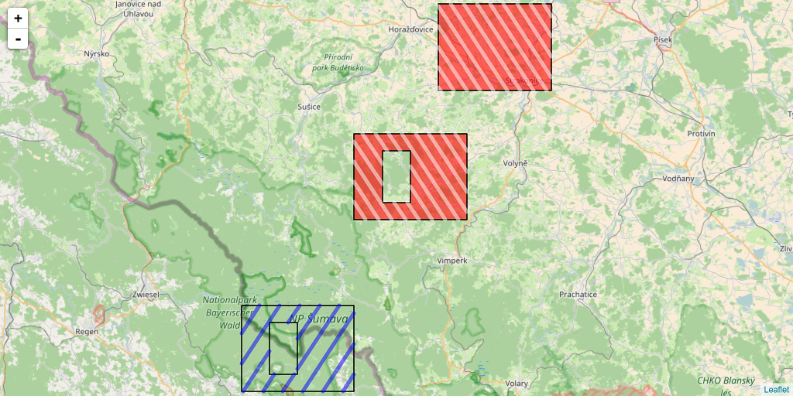

```{r setup, include = FALSE}
knitr::opts_chunk$set(
  collapse = TRUE,
  comment = "#>",
  fig.path = "man/figures/README-",
  out.width = "100%"
)
# Copy reference/images to man/images
# reference folder is required to work with pkgdown
if (!dir.exists("man/figures")) {dir.create("man/figures")}
file.copy(list.files("reference/figures", full.names = TRUE),
          "man/figures", overwrite = TRUE)
```

# HatchedPolygons

<!-- badges: start -->
[](https://zenodo.org/badge/latestdoi/90766217)
[](https://github.com/statnmap/HatchedPolygons/actions)
<!-- badges: end -->


This R package creates a area filled by SpatialLines to allow for hatched areas in SpatialPolygons.  
This may be particularly useful when SpatialPolygons show holes but also for drawing hatched areas in leaflet Polygons.

To install it:
```
devtools::install_github("statnmap/HatchedPolygons")
```

## Create a hatched area for SpatialPolygons in R

### With {sp}
```{r, message=FALSE}
library(sp)
library(sf)
library(HatchedPolygons)
library(ggplot2)

# Create two polygons: second would be a hole inside the first
xy = cbind(
  x = c(13.4, 13.4, 13.6, 13.6, 13.4),
  y = c(48.9, 49, 49, 48.9, 48.9)
    )
hole.xy <- cbind(
  x = c(13.5, 13.5, 13.45, 13.45, 13.5),
  y = c(48.98, 48.92, 48.92, 48.98, 48.98)
  )

# Create SpatialPolygon
xy.sp <- SpatialPolygonsDataFrame(
  SpatialPolygons(list(
    Polygons(list(Polygon(xy), 
                  Polygon(hole.xy, hole = TRUE)), "1"),
    Polygons(list(Polygon(hole.xy + 0.2, hole = TRUE),
                  Polygon(xy + 0.2),
                  Polygon(xy + 0.35)), "2")
  )),
  data = data.frame(id = as.character(c(1, 2)))
)

# Allows for different hatch densities and directions for each polygon
xy.sp.hatch <- hatched.SpatialPolygons(xy.sp, density = c(40, 60), angle = c(45, 135))

# Draw again polygons with holes
par(bg = "lightblue", mar = c(2, 2, 0.5, 0.5))
plot(xy.sp, col = c("blue", "red"))
plot(xy.sp.hatch, col = c("cyan", "grey90")[as.numeric(xy.sp.hatch$ID)],
     lwd = 3, add = TRUE)

```

### With {sf}

_Note that the current implementation transforms sf object as sp, then back to sf_

```{r}
# Also with {sf}
xy.sf <- sf::st_as_sf(xy.sp) # simulate st_read()
xy.sf.hatch <- hatched.SpatialPolygons(xy.sf, density = c(40, 60), angle = c(45, 135))

# Plot with ggplot2
ggplot(xy.sf) +
  geom_sf(aes(colour = id), 
          fill = "transparent", size = 1.5) +
  geom_sf(data = xy.sf.hatch, 
          aes(colour = ID),
          size = 1) +
  guides(col = FALSE)
```


See documentation on the pkgdown website for details : https://statnmap.github.io/HatchedPolygons/



_Description of this function can be found on [statnmap.com](https://statnmap.com/2017-05-23-how-to-fill-a-hatched-area-polygon-with-holes-in-leaflet-with-r)_  
_More on my website: [Freelance - Courses and consulting in modeling with R](https://statnmap.com/)_

There is also a vignette:
```
vignette("leaflet_shading_polygon", package = "HatchedPolygons")
```

Citation:   
Sébastien Rochette. (2017, August 18). Hatched area in polygons with R - v0.1.0. Zenodo. <http://doi.org/10.5281/zenodo.845493>
