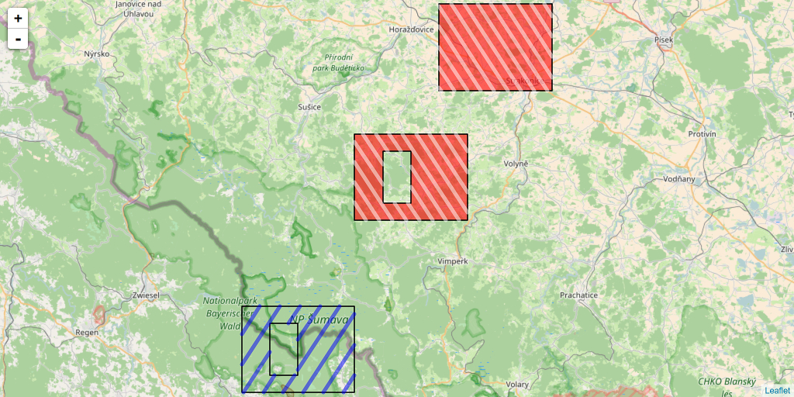

# HatchedPolygons

<!-- badges: start -->

<!-- badges: end -->

## Create a hatched area for SpatialPolygons in R

This R package creates a area filled by SpatialLines to allow for
hatched areas in SpatialPolygons.  
This may be particularly useful when SpatialPolygons show holes but also
for drawing hatched areas in leaflet Polygons.

To install it:

    devtools::install_github("statnmap/HatchedPolygons")

Read documentation on the pkgdown website :
<https://statnmap.github.io/HatchedPolygons>

*Description of this function can be found on
[statnmap.com](https://statnmap.com/2017-05-23-how-to-fill-a-hatched-area-polygon-with-holes-in-leaflet-with-r)*  
*More on my website: [Freelance - Courses and consulting in modeling
with R](https://statnmap.com/)*

There is also a vignette:

    vignette("leaflet_shading_polygon", package = "HatchedPolygons")

Citation:  
Sébastien Rochette. (2017, August 18). Hatched area in polygons with R -
v0.1.0. Zenodo. <http://doi.org/10.5281/zenodo.845493>
